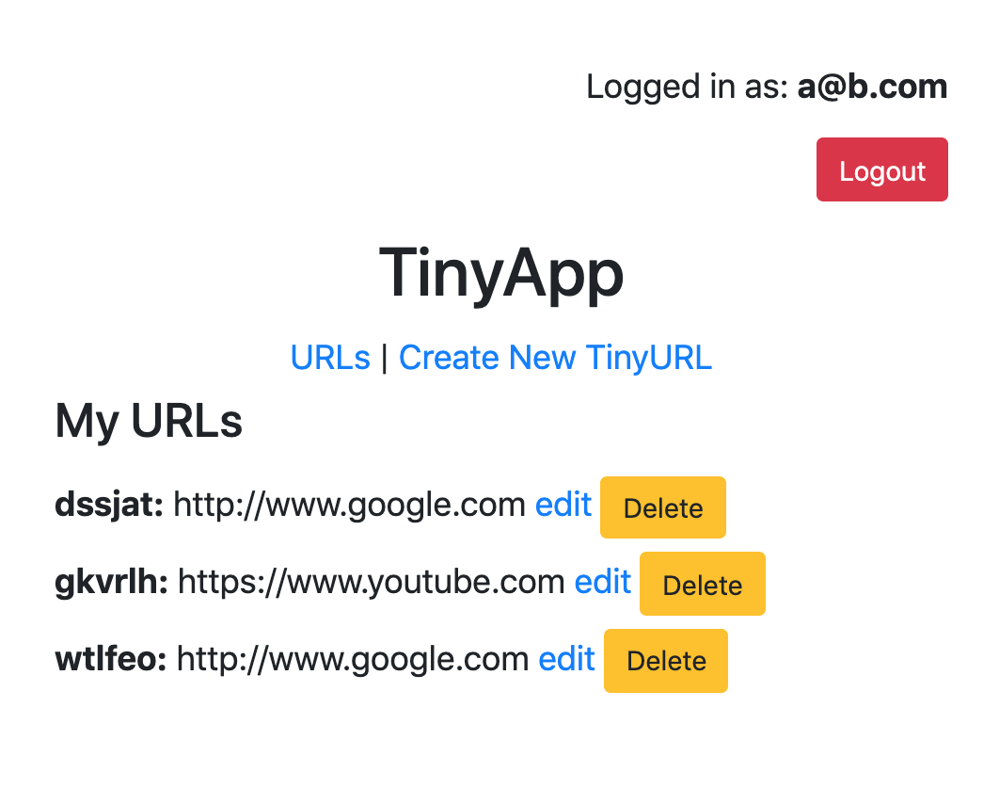

# Tiny App

## Description

This is an app build with Node and Express to allow users to shorten urls.

## Getting Started

Install all dependencies using `npm install`

Run the server using `npm start`

NOTE: The server will run on port 8080. Ensure that it is not listening for other requests.

## Future Work
- Use an actual database to store url and user information
- Make the layout nicer
- Add Required Screen Shots